# API Architecture

> **Bootstrap draft derived from approved foundation and operator architecture brief — pending human review**

**Document Status.** This document is a **bootstrap architectural specification** — the
canonical API architecture for the Stratifit Platform, derived from the approved
DOMAIN_MODEL.md, SERVICE_ARCHITECTURE.md, DATA_FLOW.md, and EVENT_ARCHITECTURE.md and
the implemented foundation. It is pending human review.

**API implementation is deferred. Route implementation is deferred. BFF implementation
is deferred. DB/schema changes are deferred. Middleware implementation is deferred.
OpenAPI generation is deferred. Phase 2 implementation is NOT authorized by this
document.** Nothing below authorizes routes, controllers, clients, SDKs, validation
code, rate limiting, or any infrastructure. Every section describes contracts and
boundaries for future phases.

## 1. Purpose & Scope

The five prior specifications defined *what the domain is* (DOMAIN_MODEL), *where it
lives* (SERVICE_ARCHITECTURE), *how data moves* (DATA_FLOW), and *how state changes
are announced* (EVENT_ARCHITECTURE). This document defines **how applications talk to
that domain**: API ownership, the two application surfaces, BFF boundaries,
command/query separation, endpoint taxonomy and ownership, authentication,
authorization, email verification, public-safe exposure, request/response and error
contracts, validation layering, idempotency, concurrency, the async job model,
pagination, rate limiting, audit, observability, versioning, and the API↔event
relationship.

**The core API boundary**, preserved from SYSTEM_ARCHITECTURE and DATA_FLOW:

```
Browser
  ↓
Application BFF
  ↓
Authorized application/API boundary
  ↓
Owning domain module/service
  ↓
Domain state
```

And for event-derived information:

```
Domain transition
  ↓
Domain event
  ↓
Authorized consumers
  ↓
Read models/projections
  ↓
BFF
  ↓
Browser
```

**Browsers never directly access** internal domain services, workers, RunPod,
ComfyUI, GPU providers, infrastructure, or internal event streams — mechanically
enforced today by the ESLint Media boundary and enforced at runtime by BFF-only
composition.

Scope boundary: this document defines contracts and boundaries; it does not select
libraries beyond what the foundation already uses, does not implement anything, and
does not merge the two applications' contracts for convenience.

## 2. API Architecture Principles

1. **BFFs are doors, not brains.** The BFF adapts transport, enforces identity and
   authorization, shapes responses, and normalizes errors. It never owns business
   rules or tables. BFFs must NOT become hidden owners of business logic.
2. **Commands cross owning boundaries; queries read owned state.** An API endpoint
   never manipulates another module's tables — it calls the owning module's API.
3. **No endpoint exists merely because a database table exists.** Every endpoint
   traces to a domain command or a read model with a documented consumer.
4. **Never trust the browser.** Authentication state, authorization, and email
   verification are resolved server-side; client claims are never trusted.
5. **Reuse the existing authorization architecture.** `authorizeAudienceAction`
   (pure rule, `@stratifit/auth`), the `@stratifit/permissions` capability matrix,
   and owner-scoping. **Do not invent an unrelated RBAC model.**
6. **The public surface is opt-in.** A Media endpoint exists only for public-safe
   data; the default classification is internal (mirroring the `public-service`
   convention).
7. **Long-running work never blocks.** Commands that trigger async processing
   return acceptance + a resource/job ID; status is a separate read.
8. **One error shape.** A single, stable, classified error contract shared by both
   apps; no secrets, stack traces, provider internals, or infrastructure details
   ever appear in responses.
9. **Contracts are the source of truth.** Zod schemas in `@stratifit/contracts`
   define shapes; OpenAPI is generated, never hand-maintained (§26).
10. **Version by evolution, not by prefix.** Additive-first evolution in the
    contracts package; version prefixes arrive only when a contract freeze is
    needed (§24).

## 3. API Surfaces & Application Boundaries

Two separate logical API surfaces, never merged:

| Surface | Application | Nature | Root |
|---|---|---|---|
| **Media API** | `apps/stratifit-media` | Public-safe + audience-private; audience-first | `/api/media/*` |
| **Control API** | `apps/stratifit-control` | Internal, operator-only, capability-checked | `/api/control/*` |

- Both surfaces live inside their applications as Next.js server route handlers
  (the BFF pattern of §4) until a second consumer justifies extraction
  (SERVICE_ARCHITECTURE OQ2).
- **Contracts are not shared merely for convenience**: Media consumes public-safe
  contracts; Control consumes the full contract set. Where a shape exists in both
  (e.g., message author kinds), it is the *same contract*, not a copy.
- The existing foundation endpoints are the seeds: Media's `POST /api/messages`
  (verification-enforced conversation start) and Control's `/api/health` (the
  health route sits outside the taxonomy as platform infrastructure).
- Internal service-to-service interaction remains **in-process typed module APIs** —
  not HTTP. HTTP exists only where an application boundary exists. When a module is
  extracted (Stage 4), its typed surface gains an HTTP transport without changing
  its contracts.

## 4. BFF Architecture

Each app's route-handler layer is its BFF. Division of responsibility:

| Belongs in the BFF | Must remain in domain modules |
|---|---|
| Transport adaptation (HTTP ↔ typed calls) | Business invariants and state transitions |
| Request shaping and transport validation (Zod/contracts) | Event emission (owning boundary only) |
| Authentication context resolution | Persistence |
| Authorization enforcement (capability/verification/owner-scoping) | Deterministic gate evaluation |
| Composition of multiple read sources | Cross-module coordination |
| Response shaping and public-safe projection | |
| Caching where appropriate (cache headers; short-lived response caches) | |
| Error normalization (§13) and correlation-ID assignment | |

BFF composition example: Media's content list composes the publishing read API,
audience read models, and signed media references into one response — the BFF shapes,
the modules own. Error normalization converts module outcomes (`not_authenticated`,
`email_verification_required`, `invalid_request`) into the §13 contract, preserving
today's status mapping (401/403/400) as the seed behavior.

## 5. Command/Query Separation

- **Commands** — `create`, `update`, `approve`, `reject`, `queue`, `cancel`,
  `retry`, `publish`, `unpublish`, `assign`, `take over`, and the like. They cross
  the owning domain boundary as typed calls and return command outcomes (accept,
  reject with reason, or async-accept with a job ID).
- **Queries** — `list`, `retrieve`, `search`, `status`, dashboards, analytics reads,
  production/generation/job status. They use the owning module's state or its
  read models/projections.
- **No endpoint manipulates another module's tables.** The only cross-module writes
  remain the sanctioned APIs (`assets.registerVersion`,
  `people.publishProfileSnapshot`, `jobs.enqueue`, `admin-audit.append`).
- **No endpoint exists merely because a table exists.**

## 6. Endpoint Ownership Model

Every endpoint is documented as an **endpoint card** with these fields:

application · API surface · owning bounded context · owning module · aggregate ·
command/query · authentication requirement · authorization requirement · email
verification requirement · data classification · synchronous/asynchronous ·
idempotency requirement · audit requirement.

Representative cards (the model, not an exhaustive endpoint dump — enumeration is
implementation detail):

| Endpoint (representative) | Surface | Context / module | Cmd/Query | Auth state | AuthZ | Email | Classification | Sync? | Idempotency | Audit |
|---|---|---|---|---|---|---|---|---|---|---|
| `POST /api/media/messages` | Media | Messaging / messaging module | Cmd | authenticated + email-verified | audience rule (`message`) | YES | Audience-private | Sync (accept) | Yes (key) | Via events |
| `GET /api/media/content` | Media | Public Media / publishing+audience | Query | anonymous | none | no | Public | Sync | n/a | no |
| `POST /api/media/social/like` | Media | Social Graph / social | Cmd | authenticated | audience rule (`like`) | no | Audience-private | Sync | Yes (key) | no |
| `POST /api/media/social/comment` | Media | Social Graph / social | Cmd | authenticated + email-verified | audience rule (`comment`) | YES | Audience-private | Sync | Yes (key) | no |
| `POST /api/control/productions/[id]/approve` | Control | Production / production-engine | Cmd | internal operator | `production.approve` | no | Operator-private | Sync | Yes (key) | **YES** |
| `POST /api/control/productions/[id]/queue` | Control | Production / production-engine | Cmd (async) | internal operator | `production.approve` | no | Operator-private | **Async** | Yes (key) | YES |
| `POST /api/control/generations` | Control | Generation / generation module | Cmd (async) | internal operator | `generation.request` | no | Operator-private | **Async** | Yes (key) | Via events |
| `GET /api/control/jobs/[id]` | Control | Job / jobs | Query | internal operator | role | no | Operator-private | Sync | n/a | no |
| `POST /api/control/conversations/[id]/takeover` | Control | Messaging / messaging | Cmd | internal operator | `messaging.takeover` | no | Sensitive internal | Sync | Yes (key) | **YES** |
| `POST /api/control/publications/[id]/publish` | Control | Publishing / publishing-engine | Cmd (async) | internal operator | `production.publish` | no | Operator-private | **Async** | Yes (key) | **YES** |
| `GET /api/control/audit` | Control | Admin & Audit | Query | internal operator | `audit.read` | no | Sensitive internal | Sync | n/a | no |

Rules: cards are reviewable documentation (SUGGESTION 1); a route file without a
traceable card is a review defect later; new endpoint categories extend the model,
never bypass it.

## 7. Authentication Model

Four API authentication states:

| State | Meaning | Accepted by |
|---|---|---|
| **anonymous** | No identity | Public reads (content, creators, search) |
| **authenticated** | Resolved audience identity | like, follow, save, watch progress, own reads |
| **email-verified** | Authenticated + server-derived verification | comment, share, message |
| **internal operator** | Resolved operator identity with roles | all Control API |

Rules:

- Identity is **resolved server-side** from the session/auth-subject (via the
  future `services/identity` resolution API; SERVICE_ARCHITECTURE OQ9).
- **Client claims are never trusted** — including verification flags. Verification
  state is server-derived from the auth provider.
- Control's middleware remains the **auth-gate checkpoint** it is today: routing
  decisions only; real authorization is enforced in routes/services server-side.
- Anonymous callers receive the unauthenticated error state (today's behavior:
  `identity: null → 401`).

## 8. Authorization Model

Authentication ≠ authorization. Both are enforced server-side, at the BFF boundary
and re-checked at the owning module:

1. **Audience actions** — the pure rule `authorizeAudienceAction(identity, action)`
   decides like/follow/save/comment/share/message (§9).
2. **Operator actions** — the capability matrix: `production.plan`,
   `production.approve`, `production.publish`, `generation.request`,
   `model.manage`, `workflow.manage`, `compute.allocate`, `messaging.takeover`,
   `lead.assign`, `admin.permissions`, `audit.read`, mapped from operator roles
   (`admin`, `operator`, `reviewer`, `viewer`).
3. **Resource ownership** — audience-private reads (own conversations, watch
   progress, notifications) are owner-scoped: the module returns only rows the
   resolved identity owns.
4. **No invented RBAC.** No new role system, no client-side permission checks.

## 9. Email Verification Rules

Preserved exactly, unchanged:

| State | Permitted actions |
|---|---|
| **Anonymous** | watch public content |
| **Authenticated** | like, follow, save |
| **Authenticated + email verified** | comment, share, message |

- Requirements are **data** (`verification_requirements`), extensible without
  redesigning the social system.
- Verification state is server-derived; client flags are never trusted.
- **Known tension preserved:** `EMAIL_VERIFIED_ACTIONS` in `@stratifit/contracts`
  currently lists only `comment` and `share`, while `@stratifit/auth` (the
  authoritative rule) also gates `message` with email verification. The API
  architecture follows the authoritative rule; the contracts enumeration remains
  unresolved (tension 1, §30; SUGGESTION 6 proposes the alignment).

## 10. Media API Taxonomy

Public-safe + audience-private surface, rooted at `/api/media/*`:

> **Stage 2.18 route note:** the in-app notifications surface is implemented at
> `/api/me/notifications` (GET, owner feed + derived unread count) and
> `/api/me/notifications/read` (POST, strict `{ all: true } | { ids }` union) —
> the own-state family below lists the same capabilities under the
> representative `/api/media/me/...` shape (see §13 of the implementation plan
> for the Stage 2.17-era route-shape precedent).
>
> **Stage 2.19 route note:** the analytics intake beacon (D2.19-A1, the
> platform's first intentional public unauthenticated write surface) is
> implemented at `POST /api/events/beacon`: strict-Zod envelope (eventType in
> the frozen four-kind family, optional contentRef, hashed session id, flat
> allowlisted properties, optional clientTs/eventId), 16KB pre-parse body cap,
> dual-key (source IP + hashed session) in-process fixed-window rate limit →
> 429 retryable, published-only server-side content/org resolution, whitelisted
> 202 `{ accepted, eventId, deduped }` outcome (§13 error envelope on 400/413/429).
> The route shape follows the Stage 2.17/2.18 `/api/...` precedent above.

> **Stage 2.20 route note:** the Creative / Story foundation is CONTROL-ONLY
> (D2.20-7) — implemented at `/api/control/creative/{universes,worlds,stories,
> seasons,episodes,scenes,shots}` (GET list + POST create) and
> `/api/control/creative/<aggregate>/[id]/status` (PATCH lifecycle) with the
> dedicated `creative.manage` (admin+operator) / `creative.read` (all four
> roles) capability family (D2.20-5 — NOT derived from `production.*`), strict
> Zod, §13 error envelope, server-derived org/operator authority, in-
> transaction parent-chain integrity (same-org, non-retired parents), the
> frozen D2.20-6 lifecycle state machines, and the fourteen same-transaction
> audit actions (D2.20-8). NO Media surface exists; scripts and the
> world-building catalog remain deferred (D2.20-2/D2.20-3); no creative events
> (D2.20-4).
> **Stage 2.21 route note:** the Rights & Consent foundation is CONTROL-ONLY
> (D2.21-2: ports UNWIRED; evaluation seam exported but not consumed by any
> approval/authoring flow) — implemented at `/api/control/rights/owners`
> (GET list + POST create), `/api/control/rights/owners/[id]/status`
> (PATCH verification lifecycle), `/api/control/rights/grants` (GET list +
> POST create), `/api/control/rights/grants/[id]/status` (PATCH D2.21-5
> lifecycle), `/api/control/rights/grants/[id]` (GET detail incl. the
> immutable status-event history), and `/api/control/rights/status-events?
> grantId=` (GET history) with the dedicated `rights.manage` (admin+operator) /
> `rights.read` (all four roles) capability family (D2.21-4), strict Zod,
> §13 error envelope, server-derived org/operator authority, in-transaction
> owner/subject integrity (same-org, fail-closed `not_found`), and the four
> same-transaction audit actions (D2.21-8). NO Media surface; no `rights.*`
> events (D2.21-3 — `rights_status_events` is the history of record).

| Family | Routes (representative) | Command/Query | Auth state | Backed by |
|---|---|---|---|---|
| **Content reads** | `GET /api/media/content` (home / discover / trending / recommendations via mode), `GET /api/media/content/[slug]` | Query | anonymous | publishing + audience public read models; slugs only, never internal production IDs |
| **Content types** | filters over content: film, movie, series, episode, short, comedy, skit, music, music-video, documentary, live-program | Query | anonymous | same |
| **Creators** | `GET /api/media/creators`, `GET /api/media/creators/[handle]` | Query | anonymous | people public-safe fragment (publication-created profile snapshots); published character profiles where applicable |
| **Search** | `GET /api/media/search?q=` | Query | anonymous | search read model |
| **Social writes** | `POST /api/media/social/{like, follow, save}` · `POST /api/media/social/comments` · `POST /api/media/social/shares` | Command | authenticated (like/follow/save) · authenticated+email (comment/share) | social module |
| **Own state** | `GET /api/media/me/{likes, follows, progress, notifications}` | Query | authenticated | audience + social + notifications, owner-scoped |
| **Messaging** | `POST /api/media/messages` (exists) · `GET /api/media/conversations/[id]` · `GET /api/media/conversations/[id]/messages` | Command + Query | authenticated + email-verified | messaging public-safe fragment |
| **Analytics beacons** | `POST /api/media/events` | Command (fire-and-forget) | anonymous or authenticated | analytics intake, best-effort |
| **Contact / service inquiries** | via messaging (lead derived internally) | — | authenticated + email-verified | messaging → leads |

Media exposes **only public-safe data** (§25): published content metadata, public
profiles, slugs/handles. Audience-private data is returned only to its owner. The
Media API never exposes: RunPod credentials, model provider credentials, worker
credentials, storage admin credentials, internal service secrets, arbitrary
infrastructure access, raw internal event streams, production engine internals,
workflow internals, model registry internals, compute provider internals, or private
Control data.

## 11. Control API Taxonomy

Internal surface, rooted at `/api/control/*`. **Control APIs expose authorized
domain commands; they do NOT expose infrastructure primitives directly.**

| Family | Representative operations | Owning module | Capability gate |
|---|---|---|---|
| **Dashboard** | read models | audience/analytics read | role |
| **AI Director** | draft plan from brief (schema-validated suggestion) | ai-director | `production.plan` |
| **Projects** | create/update project | production-engine | `production.plan` |
| **Productions** | create, update, plan, gate, manifest, queue, cancel, retry | production-engine | `production.plan` / `production.approve` |
| **Plans / Gates / Manifests** | plan versions, gate evaluation requests, manifest reads | production-engine | plan/approve |
| **Templates** | create/version templates | production-engine | `production.plan` |
| **Creative** | universes, worlds, stories, seasons, episodes, scenes, shots, scripts, narrative catalog | creative | `production.plan` |
| **People** | digital humans, characters, personas, AI creators, voices, wardrobe, locations | people | `people.manage` / `people.read` |
| **Rights** | owners, grants, status transitions, evaluations | rights | `rights.manage` / `rights.read` |
| **Assets** | register, version, approve, derivatives | assets | `production.plan` |
| **Generations** | request generation, read provenance | generation | `generation.request` |
| **Models** | registry CRUD + versions | packages/ai (durable rows) | `model.manage` |
| **Workflows** | registry CRUD + versions | packages/workflows | `workflow.manage` |
| **Jobs** | submit, status, cancel, retry | jobs | role (`compute.allocate` where compute-bound) |
| **Compute** | usage/estimate reads; **allocation via jobs**, never direct provider control | jobs + compute | `compute.allocate` |
| **Media processing** | request derivative, status | media-processing | `production.plan` |
| **QC** | request review, record decisions | quality-control | `production.approve` |
| **Publishing** | create publication, publish, unpublish, retry | publishing-engine | `production.publish` |
| **Audience** | ops views over audience state | audience | role |
| **Messaging** | inbox, conversations, takeover, leads, assignment | messaging | `messaging.takeover` / `lead.assign` |
| **Analytics** | read models, editorial intelligence | analytics | role |
| **Campaigns** | brands, campaigns, creatives, variants | advertising | `production.plan` |
| **Administration** | permissions, memberships | admin-audit | `admin.permissions` |
| **Audit** | read audit trail | admin-audit | `audit.read` |

RunPod integration, GPU, and worker operations appear **only** as domain outcomes:
the browser requests *generation*, never *provider calls*. The provider remains
behind the domain boundary (§16.3).

## 12. Request/Response Conventions

- **JSON** bodies and responses.
- **camelCase** field naming.
- **Stable branded IDs represented as strings** on the wire (`@stratifit/contracts`
  branded types; brands exist for compile-time safety only).
- **ISO-8601 UTC timestamps** (`occurredAt`-style, `Z`-suffixed).
- **`null` vs optional**: `null` = the field exists and its value is absent;
  optional = the field may be omitted. Contracts express which applies.
- **Contract-defined enums** — string enums from `@stratifit/contracts` only; no
  ad-hoc magic strings in API contracts.
- **Pagination envelope only where needed**: `{ items, nextCursor?, total? }` for
  paginated lists; no pagination fields on single-resource responses.
- **No unnecessary universal response wrapper.** Resources return their shape
  directly; commands return their outcome; errors use §13. The existing
  `{ok, reason}` shape is a seed pattern migrating to §13 (tension 8).
- Content type `application/json; charset=utf-8` throughout.

## 13. Error Contract

The stable API error model:

```json
{
  "error": {
    "code": "email_verification_required",
    "message": "Email verification is required before messaging.",
    "correlationId": "req_01J...",
    "fieldErrors": [{ "field": "body", "message": "must not be empty" }],
    "retryable": false
  }
}
```

Classified failure codes:

| Code | Meaning | Typical status |
|---|---|---|
| `validation_error` | Transport shape failed contracts validation | 400 |
| `unauthenticated` | No valid identity for a state-requiring endpoint | 401 |
| `forbidden` | Identity valid, authorization denied | 403 |
| `email_verification_required` | Action gated on server-verified email | 403 |
| `not_found` | Resource absent or not visible to caller | 404 |
| `conflict` | Stale version / concurrency rejection (§17) | 409 |
| `rate_limited` | Policy tier exceeded (§20) | 429 |
| `domain_rule_violation` | Owning module rejected (e.g., gate fail, state-machine edge) | 409/422 |
| `dependency_failure` | Upstream module/adapter unavailable; retryable where safe | 503 |
| `internal_error` | Unexpected failure; details never exposed | 500 |

**Never exposed**: stack traces, provider internals, infrastructure secrets,
credentials, internal IDs of production entities on Media surfaces. Every error
carries a `correlationId` (§22). `retryable` guides client retry behavior.

**Migration tension documented**: the live `/api/messages` route returns
`{ok, reason}` bodies; it migrates to this envelope at Phase 2 auth wiring
(OQ7). Its 401/403/400 status mapping is preserved as the seed behavior.

## 14. Validation Architecture

Three layers, in order, each with a distinct responsibility:

```
API transport validation (@stratifit/contracts Zod schemas — shape only)
        ↓
Domain invariants (owning module — business rules, state machines)
        ↓
Deterministic production gate (evaluateProductionGate — pre-GPU checkpoint)
```

- API validation must **not** replace domain invariants: a schema-valid request can
  still be rejected by the domain (e.g., a well-formed approve command on a
  production that is not `in_gate`).
- Contracts validate transport shape; modules own semantics; the gate owns the
  pre-execution checkpoint. No layer is skipped, none is duplicated.

## 15. API Idempotency

Distinct from event idempotency (related, not the same):

| | API idempotency | Event idempotency (EVENT_ARCHITECTURE §11) |
|---|---|---|
| Key | `Idempotency-Key` header on dangerous mutations | `eventId` |
| Scope | (command, subject, key) per owning module | consumer-side dedup |
| Danger addressed | duplicate submission (double approve, double generation, double like) | duplicate processing |
| Mechanism (future) | dedup table in the owning module (SUGGESTION 5 reuses the event-processing table) | processed-events table |

Rules: mutating operations that are dangerous to duplicate accept an optional or
mandatory `Idempotency-Key` (scope decided per family — OQ3); retries with the same
key return the original result, not a second execution; long-running job submission
is always key-capable. **No implementation in this phase.**

## 16. Four API Domain Models in Depth

### 16.1 Messaging API

```
Viewer
  ↓
AI Creator Profile
  ↓
Message API (authenticated + email-verified)
  ↓
Conversation (messaging module)
  ↓
message.created event
  ↓
Communication Engine (internal orchestration)
  ↓
AI response (authorKind=ai, via messaging command API) / human takeover
  ↓
Control inbox
```

Supports: conversation creation, message creation, history reads (owner-scoped),
AI responses, human takeover (`messaging.takeover`), lead/service-inquiry
derivation (internal), assignment, status, notifications, audit. **The public API
never exposes Communication Engine internals** — only conversation/message shapes
carrying `authorKind: ai | human | system` (`MessageAuthorKind` contract). Engine
replies are commands into the messaging module, never events-as-requests.

### 16.2 Production / Generation / Jobs API

Long-running work must **not** block the HTTP request until completion:

```
command (e.g., queue production / request generation)
    ↓
production/job state (owning module; state machine respected)
    ↓
async processing (jobs → workers, Stage 2+)
    ↓
status/read model (GET status endpoints)
```

- **Submission** returns an accepted outcome with the **resource/job ID**.
- **Status** retrieval: `GET /api/control/jobs/[id]`, production status endpoints —
  read models over owned state.
- **Cancellation/retry** are commands honoring the DOMAIN_MODEL state machines
  (idempotency keys, max attempts, checkpoint resume).
- **Completion/failure** surfaces as state change + domain event → read model,
  never as a held-open HTTP response.
- **Provenance** is a query surface over immutable generation/asset records.

### 16.3 AI / Compute Security Model

```
Control API
  ↓
domain command (generation.request / compute.allocate capability-checked)
  ↓
production/jobs/compute boundary
  ↓
ComputeManager
  ↓
ComputeProvider adapter
  ↓
RunPod
```

**The browser never directly controls** RunPod, ComfyUI, GPU providers, provider
credentials, or worker credentials. No endpoint accepts provider identifiers,
API keys, or raw infrastructure parameters; model/workflow selection references
**registry versions only**; compute is requested as domain commands, and the
provider remains hidden behind the domain/service architecture (PRINCIPLES 4/8;
invariant 4).

### 16.4 Publishing API

Commands: **create → validate → publish → unpublish → retry/failure** per the
DOMAIN_MODEL publication state machine. External provider APIs remain behind
`PlatformAdapter` implementations; **raw provider responses never become API
contracts** — adapters normalize to opaque external IDs and delivery outcomes
(DATA_FLOW §15). Failure isolates: a failed delivery marks the distribution
attempt; masters stay valid.

### 16.5 Storage / Signed URLs

- APIs return **authorized media references** and **read-time signed URLs**
  (expiry-scoped) as appropriate for playback.
- **No storage administration** is ever exposed (no bucket enumeration, no key
  listing, no admin operations).
- Signed URLs are generated at read time per DATA_FLOW §11; binaries never pass
  through PostgreSQL (invariant 21).

## 17. Concurrency

Architectural seam only — no locking implementation is invented:

- **Stale updates / version conflicts**: versioned aggregates (plan versions,
  publication versions) and current-pointer entities carry version fields; the
  owning module performs **check-and-reject**, surfacing as `conflict` (409).
- **Concurrent operator edits**: last-writer-wins is insufficient where approvals
  are involved; approve-class commands verify the version they were issued against.
- **Duplicate commands**: handled by idempotency keys (§15), not by locking.
- **Long-running state races** (cancel during execution): state-machine edges make
  them no-ops or recorded transitions; the API surfaces the resulting state.

## 18. Async Job API Model

```
POST command
    ↓
accepted (202-style outcome)
    ↓
resource/job ID
    ↓
GET status endpoint
    ↓
completion via state change → domain event → read model
```

- Never implemented as a blocking request for long-running work.
- Status responses include execution state, progress where the job type supports
  it, and error information on failure (never infrastructure internals).
- Cancel/retry are commands with state-machine semantics (§16.2).
- **Not implemented** — the model only.

## 19. Pagination/Filtering/Sorting/Search

- **Cursor-based pagination** for public feeds (stable under inserts):
  `{ items, nextCursor? }`.
- **Offset pagination acceptable** for internal admin lists (bounded, deterministic).
- **Shared envelope shape** across Media and Control — the conventions match even
  where the surfaces differ; no arbitrary incompatibility.
- **Deterministic ordering always explicit** (`sort` + stable tiebreaker, e.g.,
  `publishedAt, id`).
- **Filtering** per family (content type, creator, date window); **search** via the
  search read model (`q` parameter); **limits bounded** (max page size per family,
  documented at implementation).

## 20. Rate Limiting

Conceptual policy tiers — **no implementation, no invented numeric limits**:

| Tier | Policy posture |
|---|---|
| Anonymous users | loose limits on public reads |
| Authenticated social writes | moderate limits; abuse controls tighten later |
| Messaging | stricter (conversation creation + message sends) |
| Comments | moderate + content-moderation pipeline (Phase 5+) |
| Public reads | generous, cache-friendly |
| Control operators | per-capability budgets, generous |
| Expensive operations | gated by **domain state machines** (gate → budget → queue), not just HTTP limits |

Ownership: Media BFF edge enforcement (transport-level) + domain state machines for
expensive operations (OQ6). Enforcement arrives in Phase 2+.

## 21. Audit

Operations requiring audit (flowing via the sanctioned `admin-audit.append` path):

- production gate decisions
- approvals (gate/QC/manifest approvals)
- publishing and unpublishing
- human takeover of conversations
- permission and role changes
- administrative changes (memberships, registry disablement)
- sensitive operator actions (rights changes, budget changes)

Aligned with EVENT_ARCHITECTURE §7 (ownership) and the security architecture:
audit records are immutable, correlation-carrying, and readable only via
`audit.read`.

## 22. Observability

Aligned with DATA_FLOW §30 and EVENT_ARCHITECTURE §18:

```
Request → request ID (assigned at BFF) → correlation set → domain operation
        → event/job → worker → provider → result
```

Recorded per request: request ID · correlation ID (and causation where applicable)
· trace ID (Stage 2+) · endpoint · actor (resolved identity kind + ID) · outcome
(success/error code) · latency · error category. **Never log secrets** — no
credentials, tokens, provider keys, or verification secrets in logs. No
OpenTelemetry/Sentry implementation in this phase.

## 23. API ↔ Event Relationship

```
API command
  ↓
domain operation (owning module)
  ↓
state transition (committed)
  ↓
domain event (owning boundary produces it)
  ↓
async consumers
```

- **An API must not directly emit arbitrary domain events.** The owning domain
  boundary produces the event after its state change commits (EVENT_ARCHITECTURE
  §2.1, §9).
- **Queries generally read domain/read-model state**, never raw event streams —
  Media's event-derived information arrives exclusively via projections (§25,
  EVENT_ARCHITECTURE §16).
- BFF-visible status is read from owned state, not from in-flight events.

## 24. API Versioning

**No version prefix initially.** Rationale:

- Both applications are internal/pre-public; the contract source of truth is the
  `@stratifit/contracts` package — a single, already-versioned artifact.
- Evolution is **additive-first** (EVENT_ARCHITECTURE §6 discipline applied to API
  contracts): optional fields, appended enum values, never renames or removals.
- A `/v1`-style prefix (or header versioning) is introduced **only when an external
  contract freeze is needed** — first external consumer, partner API, or public
  developer surface (OQ1). At that point, the existing additive history maps
  cleanly onto a frozen v1.
- Deprecation, when needed later, follows announced windows + migration paths
  (§26 governance seam).

## 25. Public/Internal API Boundaries

Four API tiers and their trust boundaries:

| Tier | Surface | Trust boundary | Examples |
|---|---|---|---|
| **Public-safe API** | Media, no auth | Browser → Media BFF → public read models | content, creators, search |
| **Audience-private API** | Media, authenticated (+email where gated) | Owner-scoped; identity server-resolved | own conversations, progress, notifications, social writes |
| **Internal Control API** | Control, capability-checked | Operator session → capability matrix | all `/api/control/*` families |
| **Internal service-to-service** | In-process module APIs (no HTTP today) | Module boundary; extraction adds transport without changing contracts | module APIs |

**Internal APIs are never exposed through Media** — mechanically enforced by the
ESLint boundary (Media cannot import internal packages/services) and by BFF
composition rules (§4). Media never relays raw internal responses; it projects
public-safe shapes.

## 26. OpenAPI Role

- **Contracts are the source of truth** — Zod schemas in `@stratifit/contracts`.
- **OpenAPI is a generated artifact**: derived from contracts for documentation and
  contract-validation purposes (client generation, drift checks) — never
  hand-maintained, never the source of truth.
- **No OpenAPI file is generated now.** Generation arrives with the first API
  expansion beyond the messaging surface (OQ2).
- Schema governance (additive-first evolution, deprecation windows) follows
  EVENT_ARCHITECTURE §6/§19 applied to API contracts.

## 27. Diagrams

The twelve diagrams and their homes:

| # | Diagram | Section |
|---|---|---|
| 1 | Overall API architecture | §2 |
| 2 | Media BFF boundary | §4 |
| 3 | Control BFF boundary | §4 |
| 4 | Public vs internal trust boundaries | §25 |
| 5 | Authentication/authorization flow | §7/§8 |
| 6 | Email verification action gating | §9 |
| 7 | Command → domain → event flow | §23 |
| 8 | Async job API lifecycle | §18 |
| 9 | Messaging API flow | §16.1 |
| 10 | AI/compute API security boundary | §16.3 |
| 11 | Publishing API flow | §16.4 |
| 12 | API error/observability flow | §13/§22 |

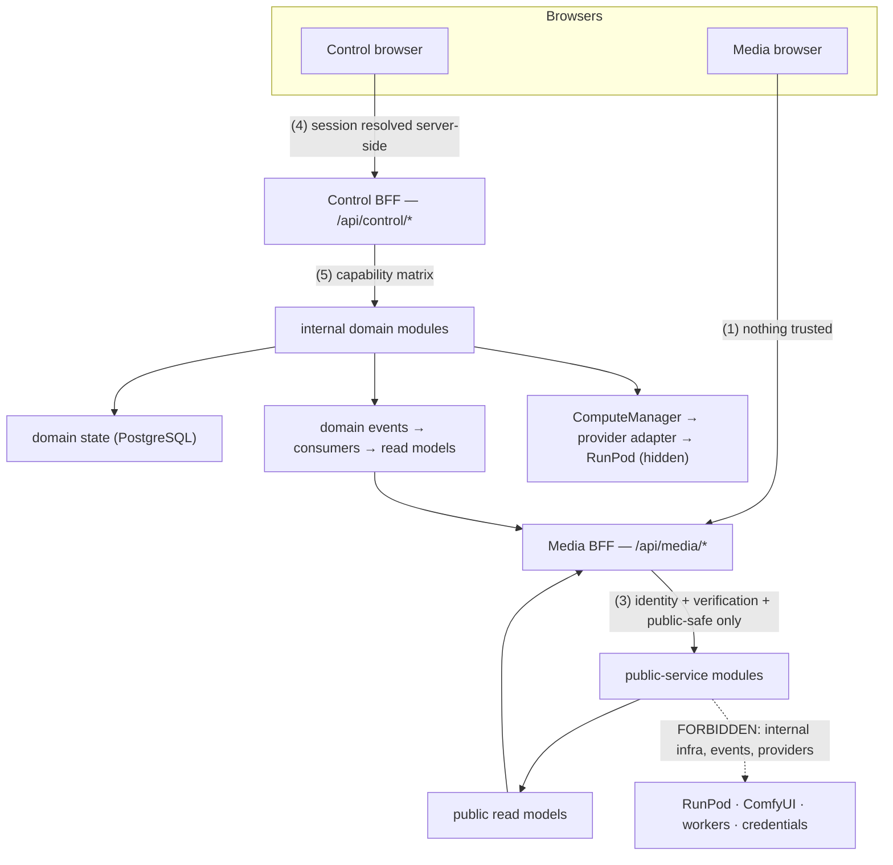

**Diagram 1 — overall API architecture** (the two BFF doors; the trust moments; the
forbidden path; the hidden provider chain).

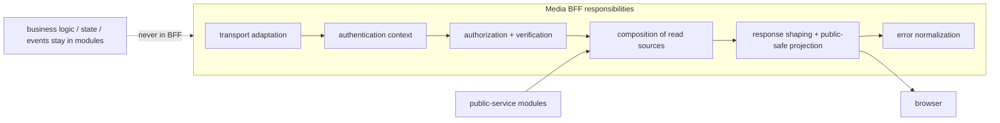

**Diagram 2 — Media BFF boundary.**

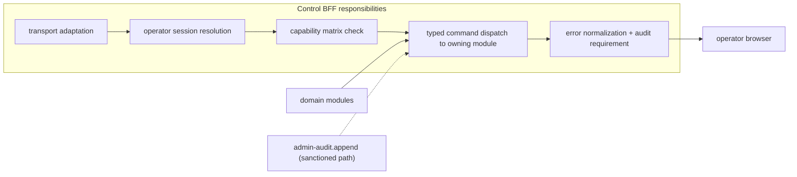

**Diagram 3 — Control BFF boundary.**

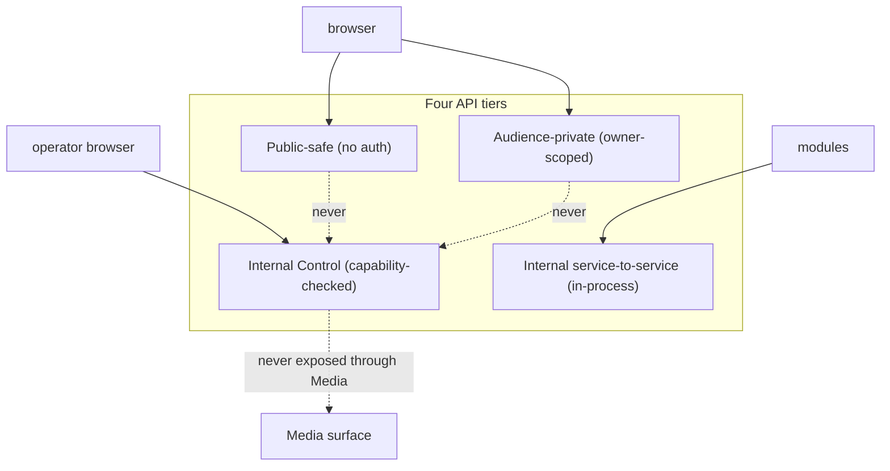

**Diagram 4 — public vs internal trust boundaries.**

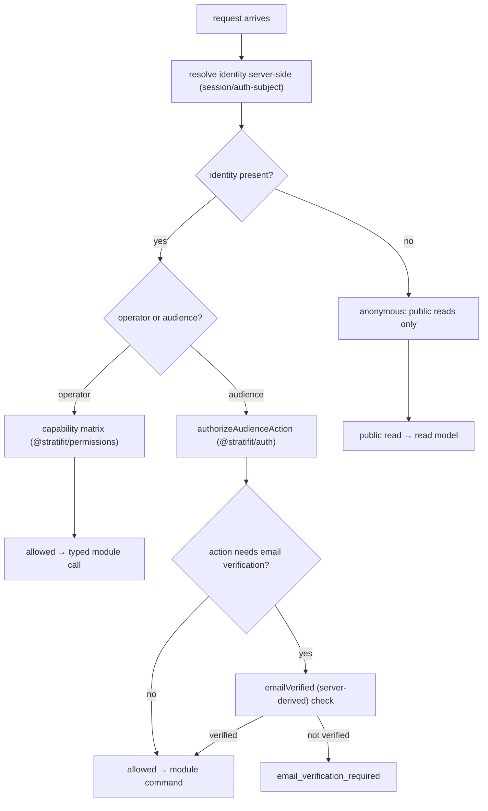

**Diagram 5 — authentication/authorization flow.**

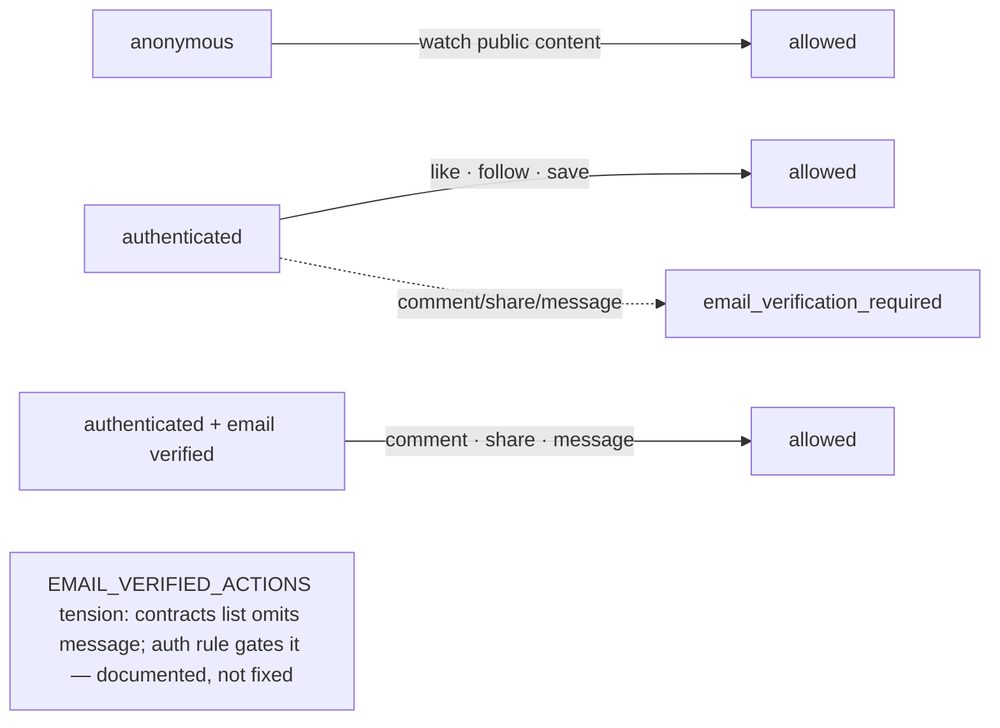

**Diagram 6 — email verification action gating.**

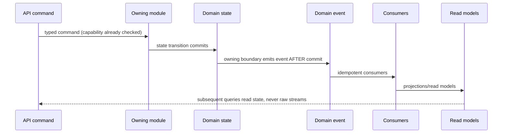

**Diagram 7 — command → domain → event flow.**

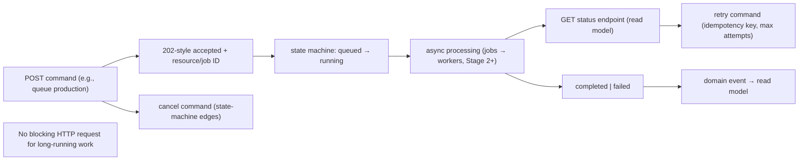

**Diagram 8 — async job API lifecycle.**

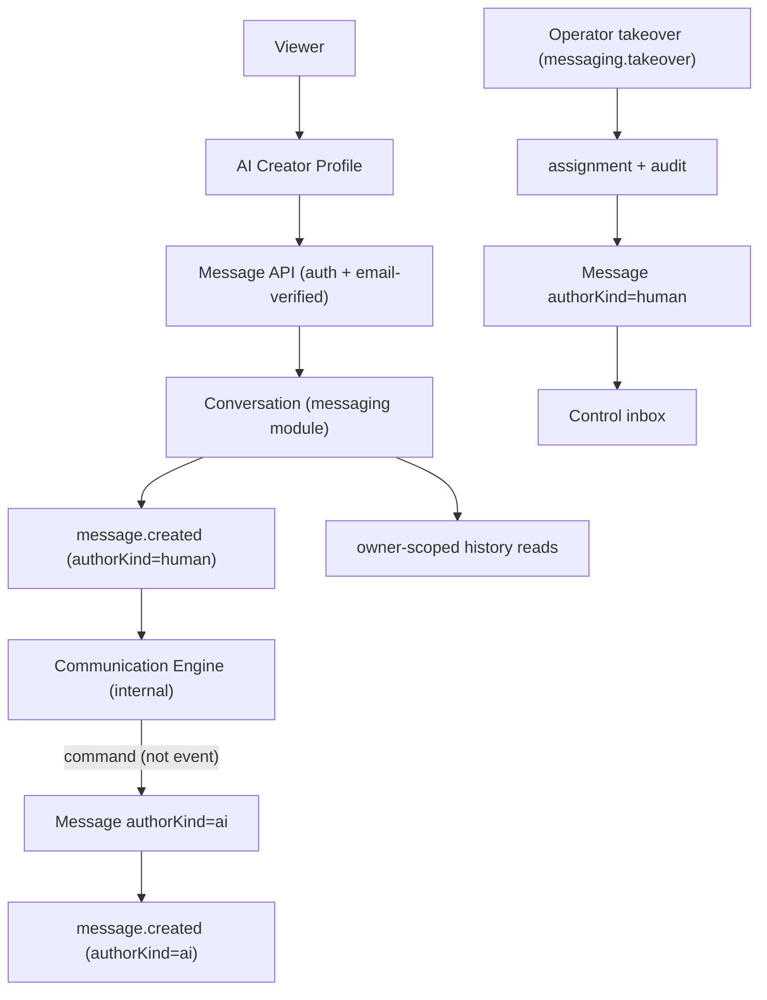

**Diagram 9 — messaging API flow.**

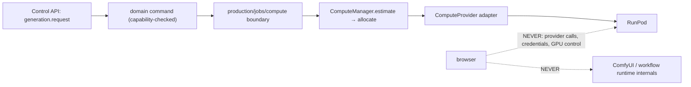

**Diagram 10 — AI/compute API security boundary.**

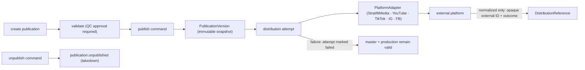

**Diagram 11 — publishing API flow.**

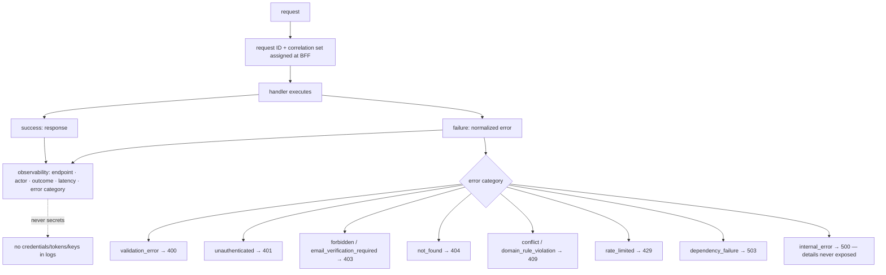

**Diagram 12 — API error/observability flow.**

## 28. Open Questions

Exactly eight. Each: Question / Why it matters / Recommendation / **Decision
required: YES**.

1. **Versioning trigger.**
   Question: introduce URL/header API versioning now, or only when an external
   contract freeze is needed?
   Why it matters: premature `/v1` freezes shapes the platform is still allowed to
   evolve; too-late versioning breaks early integrators.
   Recommendation: none now (contracts package is the versioned source); add `/v1`
   at the first external consumer or partner surface.
   Decision required: YES.

2. **OpenAPI generation timing.**
   Question: derive OpenAPI from contracts now, or defer until the API surface
   expands beyond messaging?
   Why it matters: documentation drift vs setup/maintenance cost on a two-endpoint
   surface.
   Recommendation: defer to the first API expansion beyond the messaging surface;
   contracts remain the source of truth.
   Decision required: YES.

3. **Idempotency-key scope.**
   Question: mandatory `Idempotency-Key` per mutating endpoint, or opt-in per
   family?
   Why it matters: client complexity and storage cost vs duplicate-submission
   safety (double approve, double generation).
   Recommendation: mandatory for job-submission and social-write families; opt-in
   elsewhere.
   Decision required: YES.

4. **Pagination convention unification.**
   Question: cursor pagination everywhere, or cursor for public feeds and offset
   for admin lists?
   Why it matters: client consistency vs admin ergonomics; mixed conventions raise
   client cost.
   Recommendation: cursor for feeds, offset for admin lists, one shared envelope
   shape.
   Decision required: YES.

5. **Public-safe endpoint governance.**
   Question: who approves new Media API endpoints, and where does the allowlist
   live?
   Why it matters: the API-side mirror of the import blocklist/public-service
   opt-in must be auditable, or the public boundary erodes silently.
   Recommendation: an endpoint-registry table (successor to §6 cards) reviewed per
   addition, gated like the ESLint boundary.
   Decision required: YES.

6. **Rate-limit policy ownership.**
   Question: BFF-edge middleware vs module-level/domain state-machine gating?
   Why it matters: abuse-control placement vs domain coupling; expensive
   operations need domain gating regardless of HTTP limits.
   Recommendation: BFF edge for transport-level tiers; domain state machines gate
   expensive operations.
   Decision required: YES.

7. **Error-contract governance.**
   Question: adopt the full §13 error envelope now (migrating the live
   `/api/messages` `{ok, reason}` shape), or defer migration to Phase 2?
   Why it matters: backward compatibility of the one live endpoint vs contract
   consistency from the start.
   Recommendation: adopt the envelope; migrate `/api/messages` during Phase 2 auth
   wiring.
   Decision required: YES.

8. **Control read-model strategy.**
   Question: live domain reads for dashboards, or dedicated dashboard projections?
   Why it matters: dashboard latency and query amplification on domain tables vs
   projection complexity.
   Recommendation: live reads at Stage 1; introduce projections on measured need.
   Decision required: YES.

## 29. Architectural Suggestions

Exactly six. **None is implemented by this document.**

1. **SUGGESTION** — What: an endpoint-card registry as a reviewable table (this
   document seeds the model; a later CI check verifies route files carry matching
   annotations).
   Why: makes the endpoint-ownership model mechanically auditable as the surface
   grows.
   Changes approved architecture: NO.

2. **SUGGESTION** — What: a shared `ApiError` Zod schema in `@stratifit/contracts`
   implementing the §13 envelope, used by both apps.
   Why: one source of truth for the error shape; transport validation for free.
   Changes approved architecture: NO.

3. **SUGGESTION** — What: extend `PublicationRecord.contentType` (and the public
   content-type enums) together with DOMAIN_MODEL's taxonomy at the public-content
   phase.
   Why: resolves tension 3 at the moment the content types are actually needed.
   Changes approved architecture: NO.

4. **SUGGESTION** — What: a standardized signed-URL response shape
   (`{ mediaRef, signedUrl, expiresAt }`) for all media-bearing responses.
   Why: one playback contract across content and creator surfaces.
   Changes approved architecture: NO.

5. **SUGGESTION** — What: API idempotency dedup reuses the same table/mechanism as
   event-processing dedup (one infrastructure, two applications).
   Why: avoids two dedup infrastructures with identical semantics.
   Changes approved architecture: NO.

6. **SUGGESTION** — What: add `message` to `EMAIL_VERIFIED_ACTIONS` (and `message`
   to `SocialAction`) when approved.
   Why: aligns the contracts enumeration with the authoritative `@stratifit/auth`
   rule, resolving tension 1.
   Changes approved architecture: NO.

## 30. Contradictions & Known Tensions

**Contradictions found: none** — checked against the five prior architecture
documents, the foundation documents, the contracts, and the live app/service
boundaries (including the Media boundary and the existing route inventory:
`/api/health`, middleware checkpoint, `/api/messages`).

**Preserved tensions (documented previously — NOT fixed here):**

1. `EMAIL_VERIFIED_ACTIONS` omits `message` while `@stratifit/auth` gates message
   with email verification (§9; SUGGESTION 6).
2. `InMemoryPublicationStore` does not yet represent immutable publication version
   rows (development placeholder).
3. `PublicationRecord.contentType` is narrower than the eventual public-content
   taxonomy (SUGGESTION 3).
4. Like/follow require authentication but not email verification — consistent with
   the approved architecture; documented to prevent over-restriction.
5. `DomainEventName` mixes domain/infrastructure/telemetry classes
   (EVENT_ARCHITECTURE §28.5).
6. Event payload is currently a generic record; payload validation is
   convention-based (EVENT_ARCHITECTURE §28.6).
7. `InProcessEventPublisher` awaits handlers inline without Stage-1 isolation
   (EVENT_ARCHITECTURE §28.7).

**New tension documented by this investigation:**

8. **The live `/api/messages` route returns `{ok, reason}` bodies** while this
   architecture specifies the richer §13 error envelope. Documented as a migration
   step (OQ7, Phase 2); not fixed here.

## 31. Verification

Checklist for this specification (documentation-only task):

1. API_ARCHITECTURE.md exists — ✅ (this file).
2. Required bootstrap header present — ✅ (line 3).
3. All 32 sections present — ✅ (§1–§32).
4. Exactly 12 Mermaid diagrams — ✅ (§27; counted in the build report).
5. Exactly 8 open questions — ✅ (§28).
6. Exactly 6 suggestions — ✅ (§29), all "Changes approved architecture: NO".
7. All preserved tensions present — ✅ (§30: 7 + 1 new).
8. Control/Media separation preserved — ✅ (§3, §25; Diagram 4).
9. Authentication/verification rules preserved exactly — ✅ (§7, §9).
10. Public-safe boundary preserved — ✅ (§10, §25).
11. No secrets in any contract example — ✅ (§13; error model carries IDs only).
12. No API routes/BFFs/middleware/validation/rate-limiting/OpenAPI implemented; no
    code/schema/migration/infrastructure changes — ✅ (build report filesystem
    check).
13. Regression: `TURBO_FORK_OFF=1 pnpm exec turbo run typecheck lint test build
    --force` must remain **42/42 successful** — no code changes permitted to make
    it pass.

## 32. Recommended Next Task

**Phase 1 architecture documentation is now complete** — all six documents
(SYSTEM_ARCHITECTURE, DOMAIN_MODEL, SERVICE_ARCHITECTURE, DATA_FLOW,
EVENT_ARCHITECTURE, API_ARCHITECTURE) are drafted and pending human review.

**Recommended Next Task: human review of the six Phase 1 architecture documents**,
including explicit decisions on the accumulated open questions (10 DOMAIN_MODEL +
10 SERVICE_ARCHITECTURE + 8 DATA_FLOW + 8 EVENT_ARCHITECTURE + 8 API_ARCHITECTURE =
44 recorded questions), before Phase 2 (platform wiring: live Supabase auth,
database deployment, storage wiring, and the domain schema work gated on
DOMAIN_MODEL approval) begins.

**Phase 2 has NOT been started automatically.**
