# Event Architecture

> **Bootstrap draft derived from approved foundation and operator architecture brief — pending human review**

**Document Status.** This document is a **bootstrap architectural specification** — the
canonical event architecture for the Stratifit Platform, derived from the approved
DOMAIN_MODEL.md, SERVICE_ARCHITECTURE.md, and DATA_FLOW.md and the implemented
foundation. It is pending human review.

**Implementation is deferred. Database/schema work is deferred. Durable event
transport is deferred. Outbox implementation is deferred. Event producer and
consumer implementation is deferred. No packages are modified by this task** —
`packages/events` and `packages/contracts` are described here, not changed. Everything
below is architecture for future phases.

## 1. Purpose & Scope

DOMAIN_MODEL.md defined *what the domain is*; SERVICE_ARCHITECTURE.md defined *where it
lives*; DATA_FLOW.md defined *how data moves*. This document defines **how state
changes are announced**: the event taxonomy, the canonical envelope, naming and
versioning, ownership, transactional consistency (including the future outbox seam),
idempotency, ordering, failure/retry, security classification, replay, correlation,
observability, and the full derived event catalog.

The governing principle, unchanged since the foundation and preserved verbatim:

> **Events communicate state changes and integration facts. They do NOT replace
> authoritative transactional domain state.**

Scope boundaries: this document does not implement an event bus, queues, brokers,
outbox tables, schema registries, consumers, or producers, and does not select any
vendor (Kafka, NATS, Redis Streams, SQS, Pub/Sub, RabbitMQ, and BullMQ are named —
when named at all — only as future candidates, never as committed decisions).

## 2. Event Architecture Principles

1. **State owns truth; events announce it.** A domain event is emitted only *after*
   the corresponding state change is committed by the owning module. Events are
   facts, never the authority.
2. **Commands request; events announce.** Commands (typed in-process calls) remain
   the primary mechanism for requesting operations. Events are never hidden commands
   — a consumer reacts to a fact by calling an owning module's API, not by assuming
   the event was an instruction.
3. **One producer, one owner.** Every event has exactly one authoritative producer in
   one bounded context. No module emits another module's domain event.
4. **At-least-once, never exactly-once.** Consumers are idempotent by `eventId`;
   duplicates are expected and handled silently.
5. **Minimal ordering.** Per-aggregate ordering where required; no global ordering
   promises.
6. **Failures isolate.** A failed consumer never rolls back a committed domain
   transaction; a failed notification never undoes the originating action.
7. **Classification gates exposure.** Events carry classification; internal event
   streams are never exposed to Stratifit Media; public-safe facts are explicitly
   allowlisted.
8. **Meaningful facts only.** No event for every database operation — events
   represent meaningful transitions.
9. **No event sourcing.** The platform is not event-sourced; event history supports
   integration, audit, and rebuilds — it is not the source of truth.
10. **The contract is the spine.** The existing `@stratifit/events` contract
    (`EventPublisher`, `DomainEventEnvelope`, `DomainEventName`, `idempotent`) is the
    only event system; extensions are contract changes gated on approval.

## 3. Event Taxonomy

Five conceptual classes. **They are never collapsed into one generic event type.**

| Class | Definition | Authority | Current examples |
|---|---|---|---|
| **A. Domain Events** | Facts emitted by an authoritative domain boundary **after** a committed domain state change | The state row is authoritative truth; the event is its authoritative announcement | `production.approved`, `asset.created`, `message.created` |
| **B. Integration Events** | Events whose *purpose* is cross-module/process propagation — class A by origin, consumed across boundaries | Authoritative origin; derived consumption | `publication.published` (consumed by audience, notifications, people) |
| **C. Analytics Events** | Telemetry/behavior observations: views, watch progress, clicks, likes, shares, retention signals | **Telemetry — never authoritative, never written back into domain state** | `analytics.received` |
| **D. Infrastructure / Execution Events** | Worker/job/compute lifecycle information | Authoritative **within the jobs bounded context**; infrastructure execution state per DATA_FLOW | `job.created`, `job.progress`, `job.failed` |
| **E. Public-Safe Events** | Only facts/data explicitly approved for public-safe consumption | **Derived projections only** — an allowlisted subset, never raw internal streams | (future) publication-availability facts |

Explicit rules:

- **Domain events** originate from authoritative domain transitions — never from
  read paths, never speculatively.
- **Integration events** exist for cross-boundary propagation; they are not a second
  production path (class B is consumed, class A is emitted — the same envelope).
- **Analytics events are telemetry** and are never authoritative domain state; they
  are never replayed into domain state.
- **Infrastructure/execution events** describe jobs/worker/compute lifecycle; they
  are authoritative for *execution state*, not for the domain subjects they touch.
- **Public-safe events** are explicitly allowlisted derived facts/projections.
  **Media never consumes raw internal event streams** — the projection boundary
  (§16) is the only path.

**Known tension preserved:** the current `DomainEventName` enum **mixes these
classes** — `job.*` (class D) and `analytics.received` (class C) live beside genuine
domain events with no class distinction in the contract. This is documented in §28
(tension 5) and **not silently restructured**; SUGGESTION 3 proposes documenting the
classes without changing the enum.

## 4. Canonical Event Envelope

**CURRENT envelope** (implemented in `packages/contracts/src/events.ts` — unchanged
by this task):

| Field | Purpose / ownership |
|---|---|
| `eventId` | **Event identity.** Unique forever; the consumer deduplication key; this *is* the idempotency information. Owned by the producer at emission. |
| `name` | Event identity within the catalog (`DomainEventName`). Owned by the contract. |
| `sequence` (optional) | Ordering aid **within an aggregate**. Allocation ownership is Open Question 6. |
| `occurredAt` | When the transition occurred. Producer-owned. |
| `correlation` | Observability set — six optional IDs (organization, project, production, job, conversation, publication). Producers populate what applies. |
| `payload` | Event-specific data. **Owned by the emitting domain**; validation is currently convention-based (tension 6, §28). |

**TARGET additions** (the future envelope; added additively with the first
durable-transport phase — Open Question 1):

| Field | Reason it exists | Owner |
|---|---|---|
| `eventVersion` | Payload schema version (starts at 1); drives the compatibility rules of §6. **One version concept — no separate `schemaVersion` field.** | Producer, at emission |
| `producer` | Emitting module identity — ownership auditing, durable-transport routing | Producer, fixed per event |
| `aggregateType` / `aggregateId` | Make `sequence` meaningful; enable per-aggregate ordering (§12) and targeted consumers | Producer |
| `causationId` | The `eventId` (or command reference) of the **immediate cause** — the causation chain. Single field, not a chain array (Open Question 7) | Producer |
| `traceId` | Cross-process distributed tracing at Stage 2+; **absent until distributed execution exists** | Composition root / BFF |
| `classification` | Security gating (§15); the machine-checkable hook for the public-safe allowlist (§16) | Producer, per event type |

**Deliberately rejected fields:** a generic `metadata` bag (grab-bags leak secrets —
every field must have a reason and an owner) and a separate idempotency field
(`eventId` already provides event identity and is the deduplication key).

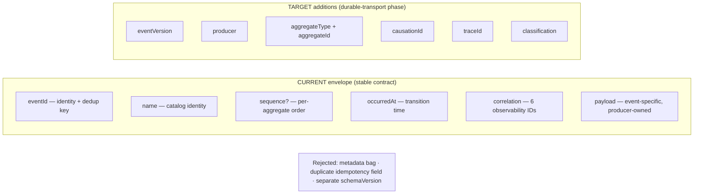

**Diagram 2 — envelope anatomy:** current fields are the permanent contract surface;
target fields are additive with reasons; rejected fields are named so they stay
rejected.

## 5. Event Naming & Namespaces

**Convention:** `<aggregate>.<past-tense-action>` — matching all 21 existing names.

- **Aggregate**: singular, the bounded-context entity (`production`, `generation`,
  `publication`, `message`).
- **Action**: past tense, a **meaningful fact** — never "every CRUD operation."
  `production.approved` exists; `production.field_updated` does not. Events
  represent meaningful facts/state transitions.
- **Namespaces**: taxonomy classes govern naming discipline (`job.*` = class D
  discipline: execution facts; `analytics.received` = class C discipline: telemetry)
  **without** renaming anything or splitting the enum (Open Question 2).
- **Rules for additions**: a new name must trace to (a) a DOMAIN_MODEL lifecycle
  transition, (b) an approved future-name list (DOMAIN_MODEL §35), (c) a DATA_FLOW
  flow with a documented consumer, or (d) a meaningful integration fact. Additions
  are contract changes gated on human approval (§19).

## 6. Event Versioning, Compatibility & Deprecation

- **Additive-first evolution**: payload changes prefer optional fields and appended
  enum values — never renames, never removals, never type changes.
- **`eventVersion`** (future field): every payload schema has a version; v1 is
  implicit for all current events.
- **Backward compatibility**: consumers must tolerate unknown fields and handle
  missing optional fields across versions within a major version.
- **Breaking changes**: bump `eventVersion`; **dual publishing** (v1 + v2) during the
  consumer migration window where necessary; v1 retirement only after consumer
  migration completes.
- **Deprecation**: announced with a documented window and migration path; deprecated
  names stop being emitted; historical envelopes remain readable.
- **Historical preservation**: durable transport (future) retains envelopes in their
  original version forever — a replayed 2026 event replays as v1 (§14).
- **No schema registry infrastructure is implemented**; §19 defines the governance
  seam only.

## 7. Event Ownership Model

Every event has: **one authoritative producer · one owning bounded context · an
aggregate/source · a classification · explicit consumers.**

Rules:

1. **No module emits another module's domain event.** The people module cannot emit
   `publication.published`; the publishing engine cannot emit `asset.approved`.
2. **Consumers never mutate another module's database.** Reactions go through owning
   module APIs — the four sanctioned cross-module writes
   (`assets.registerVersion`, `people.publishProfileSnapshot`, `jobs.enqueue`,
   `admin-audit.append`) — or the consumer's own aggregates.
3. **Consumer registration** makes integration coupling explicit: the catalog (§8)
   lists every consumer per event (SUGGESTION 5 proposes CI/review enforcement).
4. **Classification** is part of ownership: the producer classifies its events (§15).

| Event family | Owner (producer) | Aggregate | Class | Classification |
|---|---|---|---|---|
| `production.*` | production module | Production | A | Operator-private |
| `job.*` | jobs module | Job | D | Operator-private |
| `generation.*` | generation module | Generation | A | Operator-private |
| `asset.*` | assets module | Asset version | A | Operator-private (public-safe when referenced by publication) |
| `publication.*` | publishing engine | Publication | A/B | Operator-private; availability facts public-safe via allowlist |
| `conversation.*`, `message.*` | messaging module | Conversation/Message | A | Audience-private + operator-visible |
| `qc.*` | quality-control module | QC Review | A | Operator-private |
| `rights.*` | rights module | Rights Grant | A | Sensitive internal |
| `lead.*` | messaging module | Lead | A | Operator-private |
| `campaign.*` | advertising module | Campaign | A | Operator-private |
| `creator.*` | people module | AI Creator profile | A | Public-safe via allowlist |
| `analytics.received` | analytics module | — (intake) | C | Audience-private minimized |

## 8. Event Catalog

**The 21 existing names — the existing contract set, preserved unchanged:**

`production.created` · `production.updated` · `production.approved` ·
`job.created` · `job.started` · `job.progress` · `job.completed` · `job.failed` ·
`job.cancelled` · `generation.created` · `generation.completed` ·
`generation.failed` · `asset.created` · `asset.approved` · `publication.created` ·
`publication.published` · `publication.failed` · `conversation.created` ·
`message.created` · `message.read` · `analytics.received`.

**Approved extensions from DOMAIN_MODEL §35** (12 names, already sanctioned by the
approved domain model):

`asset.rejected` · `qc.approved` · `qc.rejected` · `rights.granted` ·
`rights.revoked` · `rights.expired` · `publication.unpublished` · `lead.created` ·
`lead.assigned` · `campaign.created` · `creator.published` · `creator.unpublished`.

**Additional justified lifecycle events** (15 names, each traced to a state machine
in DOMAIN_MODEL §32 or a DATA_FLOW chain — additions require approval):

| Event | Justification | Producer → consumers |
|---|---|---|
| `production.planned` | plan-version transition completes; manifest builder needs the fact | production → audit |
| `production.gate_decided` | Gate Decision Record written (pass or fail) — the approval record is the fact | production → audit, operators |
| `production.queued` | `approved → queued`; jobs enqueue follows | production → jobs, audit |
| `production.completed` | post-production + QC complete; publishing eligibility fact | production → publishing, editorial |
| `production.failed` | terminal failure state | production → audit, editorial |
| `production.cancelled` | terminal state | production → jobs (cancel cascade), audit |
| `production.archived` | terminal state | production → audit |
| `generation.started` | `requested → running` | generation → observability, operators |
| `generation.superseded` | corrections supersede; lineage fact | generation → audit |
| `generation.cancelled` | terminal state | generation → jobs, audit |
| `job.queued` | `created → queued` | jobs → workers (Stage 2) |
| `job.claimed` | worker lease acquired | jobs → observability |
| `job.retrying` | failed → queued with attempt count | jobs → observability, audit |
| `conversation.taken_over` | human takeover recorded (assignment + audit fact) | messaging → notifications, audit |
| `qc.requested` | review lifecycle starts | quality-control → reviewers |

**Total documented catalog: 48 names** (21 existing + 12 approved extensions + 15
justified additions). Every name is traceable to authoritative architecture. No
arbitrary events were invented.

**Deliberate non-additions (documented reuse rules):**

- **Localization reuses generation/asset/publication events with variant data.** A
  localized variant is a derived asset version + publication-version metadata: its
  generation emits `generation.*`, its output registers via `asset.*`, its
  publication emits `publication.*` — with language-variant facts in the payload. A
  parallel `localization.*` taxonomy would duplicate three families for no new
  integration fact.
- **Advertising creative publication uses `publication.*`.** Campaign creatives go
  public through the same publishing engine and adapters (DATA_FLOW §18); there is
  no advertising-specific publication path, so there is no advertising-specific
  publication event. Advertising contributes `campaign.created` — anything more
  invents events without consumers.
- **No notification-delivery domain event taxonomy.** Delivery results are
  infrastructure execution state (class 7 of DATA_FLOW), not domain facts.
- **No per-CRUD event explosion.** The naming rule (§5) excludes them.

## 9. Transactional Consistency & the Outbox Seam

Three distinct things must never be conflated:

1. **The domain transition / fact itself** — the committed state change in the
   owning module's tables. Authoritative.
2. **The current in-process event publication mechanism** — `InProcessEventPublisher`.
3. **Future durable event recording through an outbox** — architecture only.

**CURRENT (accurate description — no transactional durability is claimed):**

```
domain state mutation
        ↓
      COMMIT
        ↓
current in-process EventPublisher
        ↓
same-process handlers
```

The current publisher is:

- **same-process**;
- **invoked after commit**;
- **non-durable** — a crash between commit and publish loses the announcement;
- **inline-await** — handlers are awaited inline, so **handler failures can
  propagate into the producer flow**;
- it provides **no transactional durability** — and none is claimed.

This is accurate description, not criticism; it is acceptable at Stage 1 and is a
documented tension (§28, tension 7). **The implementation is not modified by this
task.**

**FUTURE (the outbox seam — architectural only, no implementation, no vendor
selected):**

```
domain state mutation
+
outbox event record
        ↓
   SAME TRANSACTION
        ↓
      COMMIT
        ↓
    dispatcher (Stage 2 worker)
        ↓
   durable transport (vendor deliberately undecided)
        ↓
 at-least-once consumers (dedup by eventId)
```

**The invariant**: **the dispatcher and consumers never observe an uncommitted
domain transition** — the outbox record and the state mutation commit atomically or
not at all; the dispatcher only reads committed outbox rows. The outbox is a future
architectural seam only: no outbox implementation, no vendor selection, and the
`EventPublisher` interface does not change when the seam arrives.

```mermaid
flowchart TD
    subgraph NOW["CURRENT — Stage 1 (accurate)"]
        S1["domain state mutation"] --> C1["COMMIT"] --> P1["in-process EventPublisher (after commit)"] --> H1["same-process handlers awaited inline — non-durable; handler failure can propagate"]
    end
    subgraph FUT["FUTURE — Stage 2 seam (architecture only)"]
        S2["domain state mutation"] --> OB["+ outbox event record"] --> C2["SAME TRANSACTION COMMIT"] --> D2["dispatcher (worker)"] --> T2["durable transport (vendor undecided)"] --> CN2["at-least-once consumers — dedup by eventId"]
    end
    INV["Invariant: dispatcher and consumers never observe an uncommitted domain transition"]
```

**Diagram 6 — the future transactional outbox seam** (with the current mechanism
shown for contrast; the two flows are the boundary between Stage 1 and Stage 2).

## 10. Synchronous vs Asynchronous Boundaries

**Synchronous** (typed in-process calls) when:

- the caller depends on the result;
- the transaction depends on the result;
- a domain invariant must hold before commit;
- capability/permission checks are required;
- gate decisions are required;
- immediate registration is required (e.g., generation output registration).

**Asynchronous** (events / jobs) for:

- propagation of committed facts;
- notifications;
- projections / read models;
- analytics;
- profile snapshots;
- long-running jobs (→ workers).

Explicit stance: **commands are the primary mechanism for requesting operations.
Events announce facts. Events are not hidden commands. The architecture is NOT
event-driven everywhere.** A consumer that needs an action taken issues a command to
the owning module; it does not bend an event into a request.

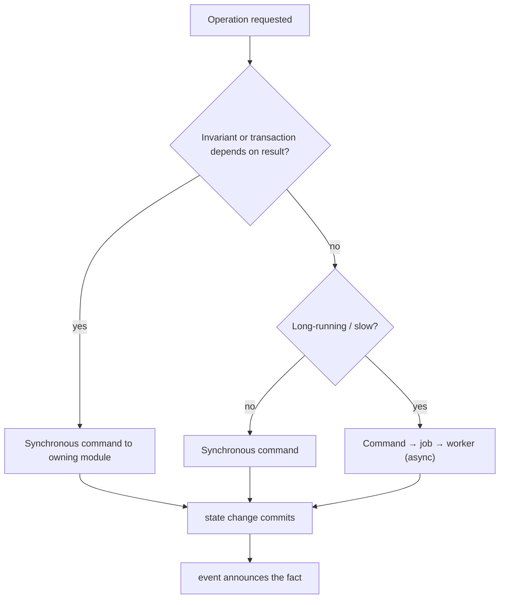

**Diagram 5 — sync vs async decision.**

**Diagram 4 — state → event → consumer flow** (the committed-fact propagation path;
the event never precedes the commit and never carries an instruction):

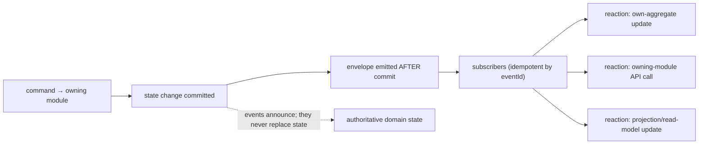

## 11. Idempotency Model

Delivery assumption: **at-least-once. Exactly-once is never claimed.**

- **Event identity**: `eventId`, unique forever — the identity and the only
  deduplication key (no separate idempotency field, §4).
- **Consumer deduplication**: the `idempotent` wrapper today (in-memory by eventId);
  a durable processed-events table at the outbox seam.
- **Idempotent handlers**: every consumer is safe on re-delivery and replay — e.g.,
  the audience consumer of `publication.published` upserts public content keyed by
  publication version, so a duplicate is a no-op.
- **Duplicate handling**: silent skip after dedup — never an error.
- **Retry safety**: retries re-deliver the same envelope unchanged.
- **Replay safety**: identical to duplicate handling — a replayed event is a
  redelivered event (§14).

**Diagram 3 — domain event lifecycle** (commit → emit → consume → dedup →
processed/skip):

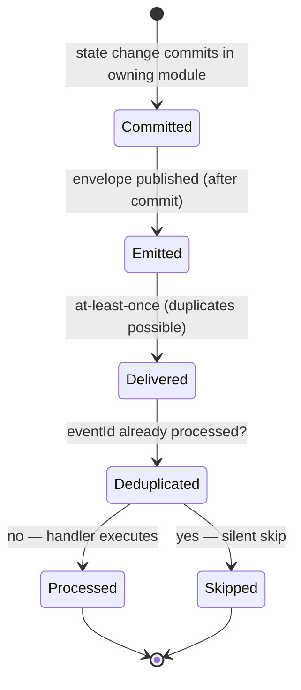

## 12. Ordering Model

**Minimum necessary guarantees only:**

- **Per-aggregate ordering** where required: production, generation, conversation,
  publication, job — via `aggregateType + aggregateId + sequence` (future fields;
  the existing optional `sequence` anticipates this). Sequence allocation ownership
  is Open Question 6.
- **No global ordering** is promised or should be assumed by any consumer.
- **Cross-aggregate reordering**: consumers tolerate events from different
  aggregates arriving out of order. When order across aggregates matters, consumers
  verify causality with `causationId` rather than arrival order — and **query
  authoritative state when in doubt**. Ordering guarantees are never load-bearing
  for correctness.

## 13. Failure, Retry & Dead-Letter Architecture

| Aspect | Architecture |
|---|---|
| **Retryable errors** | Transient/transport failures (unavailable dependency, timeout, lock contention) — retry with **exponential backoff** (conceptual mechanism) up to a policy bound |
| **Non-retryable errors** | Validation failures, schema mismatches, permanent business rejections — never retried; routed to failure handling |
| **Poison events** | Events that deterministically fail a consumer — after retry exhaustion, routed to **dead-letter/failure storage** (future infrastructure; SUGGESTION 6) |
| **Alerting** | Dead-letter arrivals and retry storms are operational signals (§18) |
| **Replay** | From failure storage or transport history after the defect is fixed — safe because consumers are idempotent (§11) |
| **Consumer isolation** | Each consumer's failure is contained to that consumer; consumers never roll back producers |

**Preserved invariants**: **a failed analytics consumer does not roll back domain
state; a failed notification does not undo the originating action** (message stays
sent; delivery results are retryable infrastructure records).

**Stage-1 limitation (documented implementation tension — NOT fixed here):**
`InProcessEventPublisher` currently **awaits handlers inline**, so a throwing
consumer can propagate into the producer flow. Open Question 3 addresses the
producer-side catch contract; no code changes in this task.

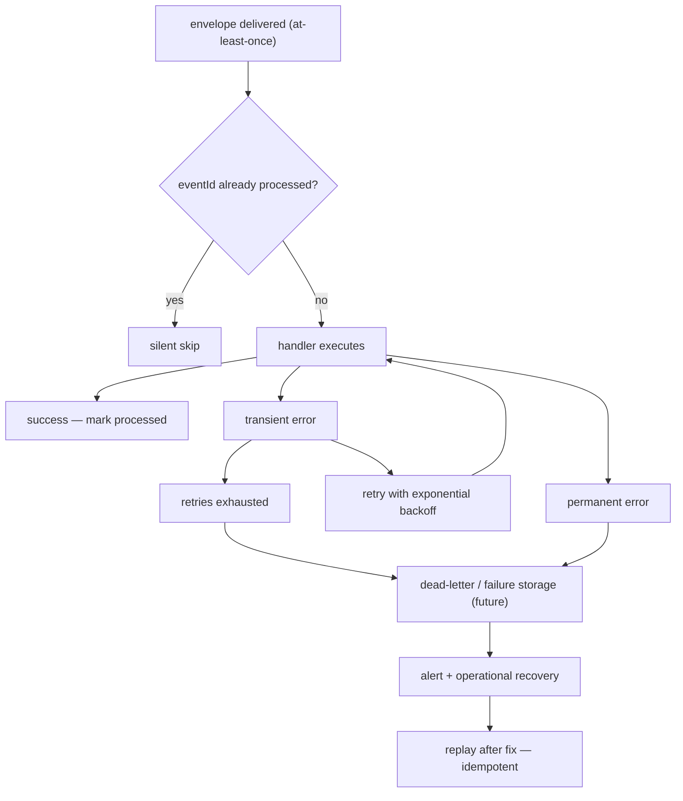

**Diagram 11 — retry/idempotency/failure flow.**

## 14. Replay & Event History

- **Events are NOT the source of truth. Domain state remains authoritative** —
  always.
- **Event history may support**: integration reprocessing (fix a consumer, replay
  its events), consumer/projection rebuilds, and audit where appropriate.
- **Replay must be idempotent**: consumers are idempotent (§11); envelopes are
  immutable; **original event versions remain preserved** — a replayed event
  replays with its original `eventVersion` and payload (§6).
- **Analytics events must never be replayed into domain state** (class C
  discipline, §3).
- **Sensitive/public data is not replayed into unsafe contexts**: replay runs
  within the internal trust zone; public-safe projections are rebuilt only from
  allowlisted facts (§16).
- **No event sourcing** is introduced: state is not derived from events; events
  derive from committed state.

## 15. Event Security & Classification

DATA_FLOW §4 classifications applied to events:

| Class | Event handling |
|---|---|
| Public | Only class-E facts, allowlisted (§16) |
| Audience-private | Message/notification/conversation payloads — internal streams only; public-safe fragments read projections |
| Operator-private | Production, QC, lead, campaign, job events — Control only |
| Sensitive internal | Rights events, rights evidence references — internal APIs + audit only |
| Infrastructure-secret | **Never appears in any event payload** |

**Never in event payloads**: RunPod credentials, model-provider credentials, worker
credentials, storage-admin credentials, infrastructure secrets, arbitrary internal
secrets — invariant 4. Provider facts travel as **reference strings** (provider
name, worker reference, opaque external ID), never credentials.

**Internal event streams are never exposed directly to Stratifit Media.**
**Public-safe events must be explicitly allowlisted** (§16, Open Question 8).

## 16. Public-Safe Projection Boundary

The only path by which event-derived information reaches Media:

```
internal events
    ↓
authorized consumers/projections
    ↓
public-safe read models (allowlisted facts only)
    ↓
Media BFF
    ↓
browser
```

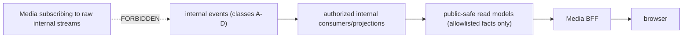

**Diagram 10 — public-safe projection boundary.** Media **never subscribes directly
to internal event streams** — not via subscriptions, not via polling internal event
stores. The projection layer is owned by public-service modules and contains only
allowlisted facts (e.g., "publication X is available") — never internal IDs, never
operator-private fields. The allowlist is governed per event (Open Question 8),
mirroring the opt-in `public-service` convention of SERVICE_ARCHITECTURE §13 and the
DATA_FLOW read-flow rule that Media must never read internal production tables.

## 17. Correlation, Causation & Tracing

Four identifiers, distinct roles:

| ID | Role |
|---|---|
| `eventId` | Identity of this fact (also the dedup key) |
| `correlationId` | The **broader business flow** — the correlation set, aligned with DATA_FLOW's 12 dimensions (organization, project, production, scene, shot, generation, asset, job, publication, conversation, message, campaign); all events of one flow share it |
| `causationId` | The **immediate cause** — the eventId (or command reference) that directly produced this event. Immediate causation vs broader correlation: causation links consecutive hops; correlation links the whole flow |
| `traceId` | Cross-process distributed trace (Stage 2+; absent until then) |

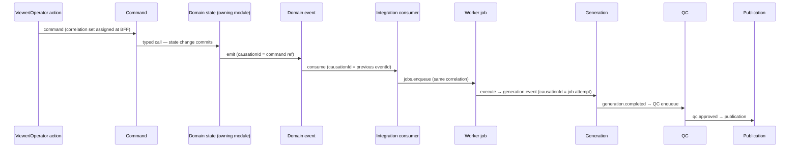

**Diagram 12 — correlation/causation chain** (viewer action → command → domain
transition → domain event → integration event → worker job → generation → QC →
publication). The chain is observable through `correlation` + `causationId` (+
`traceId` when distributed) — **never putting secrets into correlation metadata**
(correlation fields are IDs only).

## 18. Event Observability

Recorded per event and per consumption: `eventId` · `correlationId` (set) ·
`causationId` · `traceId` · producer · consumer · timestamps (occurredAt,
consumed-at) · processing duration · retry count · outcome (processed /
skipped-duplicate / failed / dead-lettered) · **error category**.

Rules: secrets never enter payloads, metadata, or logs (§15); event metrics are
telemetry (class C discipline) even when *about* class-A events; dead-letter
arrivals and retry storms are first-class operational signals (§13). **No
observability infrastructure (OpenTelemetry/Sentry) is implemented by this
document.**

## 19. Schema Governance

The governance **seam** (no schema registry is implemented):

- **Schema ownership**: each event's payload schema is owned by its producing
  module (§7) and lives in `@stratifit/contracts` as a versioned Zod schema.
- **Version numbering**: `eventVersion` (future field); v1 implicit today.
- **Backward compatibility**: additive-only within a version (§6).
- **Breaking changes**: new version + dual publishing window (§6).
- **Deprecation**: announced window + consumer migration path (§6).
- **Consumer migration**: consumers declare the versions they handle; dispatch
  routes accordingly (Stage 2+).
- **Historical compatibility**: durable transport keeps original versions readable
  forever (§14).
- **Name additions**: gated on human approval — the process defined in §5; no
  automated registry, no tooling built now.

## 20. Production Lifecycle Events

Production state machine (DOMAIN_MODEL §32) → events:

| Transition | Event | Consumers |
|---|---|---|
| created | `production.created` | audit, editorial |
| material plan change | `production.updated` | audit, editorial |
| plan version completes | `production.planned` | audit |
| gate evaluated (pass/fail) | `production.gate_decided` | audit, operators |
| required approvals granted | `production.approved` | audit, jobs (via enqueue command) |
| queued for execution | `production.queued` | jobs, audit |
| post-production + QC complete | `production.completed` | publishing (eligibility), editorial |
| terminal failure | `production.failed` | audit, editorial |
| cancelled | `production.cancelled` | jobs (cancel cascade), audit |
| archived | `production.archived` | audit |

Every production event carries the correlation set (organization, project,
production) and is **operator-private** (class A). Publishing eligibility consumes
`production.completed` + `qc.approved` facts — it never subscribes to internal
tables.

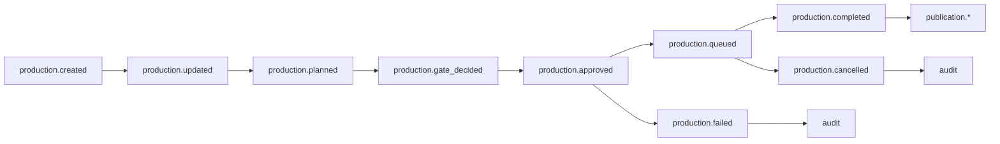

**Diagram 7 — production event flow.**

## 21. Generation & Job Execution Events

```
Generation:  created → started → completed | failed | cancelled | superseded
Job:         created → queued → claimed → started → progress → completed | failed | cancelled | retrying
```

| Area | Events | Class | Notes |
|---|---|---|---|
| Generation | `generation.created`, `generation.started`, `generation.completed`, `generation.failed`, `generation.cancelled`, `generation.superseded` | A | Provenance facts: completed/failed are terminal and immutable; superseded records corrections; completion triggers QC enqueue (DATA_FLOW chain) |
| Job | `job.created`, `job.queued`, `job.claimed`, `job.started`, `job.progress`, `job.completed`, `job.failed`, `job.cancelled`, `job.retrying` | D | Execution lifecycle; attempts immutable; idempotency key per type+target; progress events are throttled execution facts |
| Compute/execution | (no separate event family) | — | Allocations/usage are records consumed via the compute module's APIs; allocation facts ride `job.*` payloads as references. RunPod remains a provider reference |

Job events are authoritative for **execution state** only — never for the domain
subjects (a `job.failed` on a generation job does not mark the generation failed;
the generation module owns that fact).

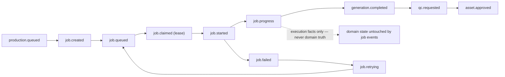

**Diagram 8 — generation/job event flow.**

## 22. QC, Publication & Localization Events

**QC**: `qc.requested` → `qc.approved` | `qc.rejected` (with `asset.rejected`
accompanying QC rejection of an asset version). QC decisions are immutable.
**QC failures block publication** — publishing consumes eligibility from QC facts
(DATA_FLOW Diagram 12).

**Publication**: `publication.created` → `publication.published` |
`publication.failed` → `publication.unpublished` (takedown). Failure isolation:
`publication.failed` marks the distribution attempt; masters and productions stay
valid; re-delivery is a state transition, not a new event family.

**Localization**: no separate event taxonomy (§8 reuse rule) — a localized variant
flows through `generation.*` (dubbing/lip-sync runs), `asset.*` (derived versions
with lineage), and `publication.*` (variant metadata in payload: language,
availability window). The payload carries the variant facts; the catalog stays
single.

## 23. Messaging, Lead & Notification Events

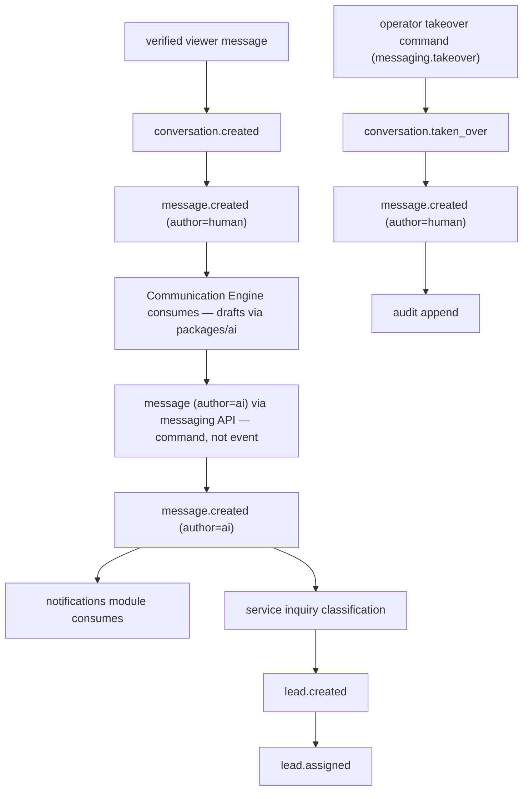

**Diagram 9 — messaging event flow.**

- Author kinds (`ai | human | system` from `MessageAuthorKind`) are payload facts on
  every `message.created`.
- The Communication Engine **consumes** `message.created` and **issues a command**
  to write its reply — events announce, commands act (§2.2, §10).
- `conversation.taken_over` records the human-takeover fact (assignment + audit).
- `lead.created` / `lead.assigned` are messaging-module aggregates' facts; Control
  inbox and analytics consume.
- **Notification delivery emits no domain events** (§8); a failed delivery never
  rolls back the message (invariant 6).

## 24. Advertising & Analytics Events

**Advertising**: `campaign.created` is the advertising family's lifecycle fact;
creative publication **reuses** `publication.*` (§8, §22); performance references
are analytics IDs.

**Analytics**: `analytics.received` is the **intake** fact — class C telemetry. The
strict separation (DATA_FLOW §19): transactional domain state ≠ domain events ≠
analytics events. **Telemetry and domain facts are conceptually separate**: analytics
events are never authoritative, never replayed into domain state, and never promote
themselves into the domain catalog. Behavioral metrics (views, watch time,
retention, completion, likes, comments, shares, follows, CTR, conversions, revenue,
messages, leads) are analytical events with domain **references** — not domain
events.

## 25. Diagrams

The twelve diagrams and their homes: **1** event architecture overview → §25 below;
**2** envelope anatomy → §4; **3** domain event lifecycle → §11 (with §13's
realization); **4** state → event → consumer flow → §10 (commit → announce →
consume path); **5** sync vs async decision → §10; **6** future transactional
outbox seam → §9; **7** production event flow → §20; **8** generation/job flow →
§21; **9** messaging flow → §23; **10** public-safe projection boundary → §16;
**11** retry/idempotency/failure → §13; **12** correlation/causation chain → §17.

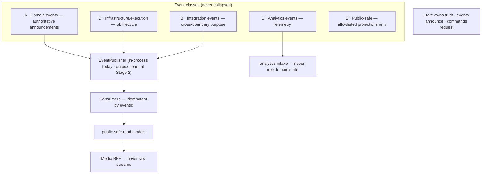

**Diagram 1 — event architecture overview.**

## 26. Open Questions

Exactly eight. Each: Question / Why it matters / Recommendation / **Decision
required: YES**.

1. **Envelope extension timing.**
   Question: extend `DomainEventEnvelope` with the proposed fields now, or with the
   first durable-transport phase?
   Why it matters: contract stability vs early typed metadata; producers writing
   payload conventions today would need migration either way.
   Recommendation: extend additively with the first durable-transport phase; until
   then producers carry producer/aggregate facts in payload conventions.
   Decision required: YES.

2. **Event-class modeling.**
   Question: keep a single `DomainEventName` enum with naming discipline, or split
   into classed enums/namespaces?
   Why it matters: taxonomy enforcement vs contract churn and import churn across
   consumers.
   Recommendation: single enum + naming/class documentation (SUGGESTION 3); revisit
   only at the outbox seam if enforcement demands it.
   Decision required: YES.

3. **Stage-1 handler failure isolation.**
   Question: add a producer-side catch contract for non-critical consumers now, or
   leave in-process semantics until the durable seam?
   Why it matters: a throwing consumer currently propagates into the producer flow
   (tension 7); "failure isolation" is aspiration at Stage 1.
   Recommendation: document a producer-side catch contract for non-critical
   consumers at implementation time (not now); true isolation arrives with the
   durable seam.
   Decision required: YES.

4. **Payload validation governance.**
   Question: producer-side mandatory schema validation at emission, or
   consumer-side only?
   Why it matters: the envelope comment says "validated payload" but the contract
   allows unknown records (tension 6) — who guarantees it?
   Recommendation: producer-side mandatory (SUGGESTION 4); a strict envelope factory
   arrives with the transport phase.
   Decision required: YES.

5. **Event retention.**
   Question: retain domain events permanently, or window them?
   Why it matters: storage cost vs replay/audit capability and provenance
   completeness.
   Recommendation: permanent retention for domain events; windowed retention for
   analytics/infrastructure events.
   Decision required: YES.

6. **Sequence allocation ownership.**
   Question: does the producer allocate `sequence` in the state-change transaction
   (at outbox time), or the dispatcher on publish?
   Why it matters: the strength of the per-aggregate ordering guarantee (§12).
   Recommendation: producer allocates in the state-change transaction; the field
   stays optional until the seam.
   Decision required: YES.

7. **Causation representation.**
   Question: a single `causationId` (immediate cause) or an explicit chain?
   Why it matters: observability granularity vs envelope weight.
   Recommendation: single immediate-cause ID; full chains reconstructed via
   correlation + trace.
   Decision required: YES.

8. **Public-safe classification governance.**
   Question: who approves class-E events, and where does the allowlist live?
   Why it matters: the Media boundary's event-side mirror must be as auditable as
   the import blocklist.
   Recommendation: explicit allowlist in contracts/config, reviewed per event,
   matching the public-service opt-in convention.
   Decision required: YES.

## 27. Architectural Suggestions

Exactly six. **None is implemented by this document.**

1. **SUGGESTION** — What: extend the envelope correlation set to all twelve
   DATA_FLOW dimensions (add scene, shot, generation, asset, message, campaign IDs).
   Why: DATA_FLOW promises these dimensions travel with flows; the current
   six-field set cannot carry them.
   Changes approved architecture: NO.

2. **SUGGESTION** — What: add `eventVersion`, `producer`, `aggregateType`,
   `aggregateId`, `causationId`, `traceId`, `classification` to the envelope (§4
   rationale per field).
   Why: typed metadata beats payload conventions at the durable-transport phase;
   enables ordering, routing, and security gating.
   Changes approved architecture: NO.

3. **SUGGESTION** — What: document `job.*` as infrastructure/execution events
   (class D) and `analytics.received` as telemetry (class C) in the contract's
   documentation — without changing the enum.
   Why: classification clarity for consumers while preserving the 21 names and
   avoiding contract churn.
   Changes approved architecture: NO.

4. **SUGGESTION** — What: producer-side mandatory payload validation — emission
   requires a schema-validated payload (per-event Zod schema in contracts).
   Why: closes the gap between the envelope's "validated payload" intent and
   `payload: z.record(z.string(), z.unknown())` (tension 6).
   Changes approved architecture: NO.

5. **SUGGESTION** — What: a consumer-registration table in this document (every
   catalog entry lists its consumers), enforced by review and later by CI.
   Why: makes integration coupling explicit and auditable; prevents undeclared
   consumers.
   Changes approved architecture: NO.

6. **SUGGESTION** — What: dead-letter storage design note — poison events routed to
   a failure record keyed by eventId with error category; replay via an
   admin-audit-gated command.
   Why: operational recovery without premature vendor selection.
   Changes approved architecture: NO.

## 28. Contradictions & Known Tensions

**Contradictions found: none** — checked against SYSTEM_ARCHITECTURE.md,
DOMAIN_MODEL.md, SERVICE_ARCHITECTURE.md, DATA_FLOW.md, the foundation documents,
the contracts, and the live package/service/app boundaries (including the Media
boundary and the zero-emission finding: no service emits events today, so this
architecture constrains future behavior without contradicting existing behavior).

**Preserved tensions (documented previously — NOT fixed here):**

1. `EMAIL_VERIFIED_ACTIONS` omits `message` while `@stratifit/auth` gates message
   with email verification (DOMAIN_MODEL SUGGESTION 6; still open).
2. `InMemoryPublicationStore` does not yet represent immutable publication version
   rows (development placeholder; DATA_FLOW §35.2).
3. `PublicationRecord.contentType` is narrower than the eventual public-content
   taxonomy (DATA_FLOW §35.3).
4. Like/follow require authentication but not email verification — consistent with
   the approved architecture; documented to prevent over-restriction
   (DATA_FLOW §35.4).

**New tensions discovered by this investigation (documented, not resolved):**

5. **`DomainEventName` mixes classes** — domain (A), infrastructure (D: `job.*`),
   and telemetry (C: `analytics.received`) names share one enum with no class
   distinction. Documented in §3; SUGGESTION 3 proposes documentation without enum
   change.
6. **`payload` is a generic record** — `z.record(z.string(), z.unknown())` makes
   "schema-validated payload" convention-based rather than contract-enforced.
   Documented in §4; Open Question 4 and SUGGESTION 4 address it.
7. **`InProcessEventPublisher` awaits handlers inline** — a throwing consumer can
   propagate into the producer flow; failure isolation is aspirational at Stage 1.
   Documented in §9 and §13; Open Question 3 addresses it. **No code changed.**

## 29. Verification

Checklist for this specification (documentation-only task):

1. EVENT_ARCHITECTURE.md exists — ✅ (this file).
2. Required bootstrap header present — ✅ (line 3).
3. All 31 sections present — ✅ (§1–§31).
4. Exactly 12 Mermaid diagrams — ✅ (§4, §9, §10, §13, §16, §17, §20, §21, §23,
   §25; counted in the build report).
5. Exactly 8 open questions — ✅ (§26).
6. Exactly 6 suggestions — ✅ (§27), all "Changes approved architecture: NO".
7. The 21 existing event names represented unchanged — ✅ (§8).
8. 48-name catalog, every name traceable — ✅ (§8).
9. All 7 known tensions preserved — ✅ (§28).
10. Transactional wording accurate — ✅ (§9: current = same-process, after commit,
    non-durable, inline-await, no durability claimed; future = outbox seam with the
    never-observe-uncommitted invariant).
11. No packages modified; no API_ARCHITECTURE.md created; no code/schema/migration
    changes — ✅ (build report filesystem check).
12. Regression: `TURBO_FORK_OFF=1 pnpm exec turbo run typecheck lint test build
    --force` must remain **42/42 successful** — no code changes permitted to make
    it pass.

## 30. Deferred Implementation

Explicitly deferred (none performed or authorized by this document): event
consumers and producers; the outbox table and dispatcher; durable transport and any
broker/vendor selection; dead-letter storage; the processed-events dedup table;
payload schemas for new events; envelope extension; schema-registry tooling;
event-level observability infrastructure; `production.started` and any unapproved
name additions. The existing `packages/events` and `packages/contracts` remain
untouched. The relational domain schema, migrations, auth wiring, and all
SERVICE_ARCHITECTURE future modules remain deferred per their own documents.

## 31. Recommended Next Task

**Recommended Next Task: API_ARCHITECTURE.md** — the final Phase 1 document: API
surface ownership, BFF route taxonomy per application, endpoint contracts per
module, security/verification enforcement points, and error contracts.

**API_ARCHITECTURE.md has NOT been started automatically.**
